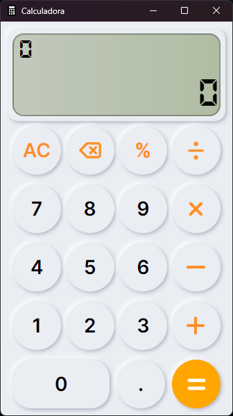

# Calculator With Electron

[](https://www.gnu.org/licenses/gpl-3.0)
[](https://www.electronjs.org/)
[](https://developer.mozilla.org/en-US/docs/Web/Guide/HTML/HTML5)
[](https://developer.mozilla.org/en-US/docs/Web/CSS)
[](https://developer.mozilla.org/en-US/docs/Web/JavaScript)

## Description

Electron Calculator is a simple calculator app built with Electron, HTML, CSS, and JavaScript. Supports basic arithmetic operations.

<p align="center">
  
</p>

## Installation

1. Make sure you have [Node.js](https://nodejs.org) installed on your system.

2. Clone this repository to your local machine using the following command:
   ```bash
   git clone https://github.com/Pablo736/CalculatorWithElectron
   ```
3. Navigate to the project directory:

   ```bash
   cd calculatorwithelectron
   ```
4. Install the required dependencies:

   ```bash
   npm install
   ```
5. Start the Electron application

   ```bash
   npm start
   ```

## License
This project is licensed under the GNU General Public License v3.0. See the `LICENSE` file for more details.